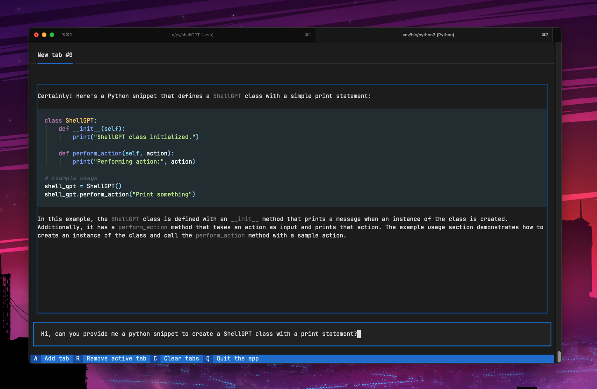

<h1 align="center">
  <br>
  <a href=""></a>
  <br>
  <br />
  TermGPT
  <br>
</h1>

<h4 align="center">A Terminal-based Client for ChatGPT! Say goodbye to the switch process between windows.</h4>

<p align="center">
  <a href="#features">Key Features</a> •
</p>



<!-- ABOUT THE PROJECT -->

## About The Project

### Overview

**TermGPT** is a streamlined, terminal-based client designed for seamless interactions with OpenAI's ChatGPT. It's born from the need to eliminate the constant window switching that developers, researchers, and enthusiasts face when jumping between their coding environment and the web-based ChatGPT interface.

### Why TermGPT?

- **Efficiency**: Stay within your terminal environment. No need to switch between windows or apps.
- **Intuitive Interface**: Designed with simplicity in mind, TermGPT ensures that the user experience is smooth, straightforward, and free of distractions.
- **Quick Access**: With TermGPT, getting a response from ChatGPT is just a command away, making it incredibly convenient for those who need instant feedback or assistance.
- **Customizable**: Being open-source, you can customize TermGPT to best fit your workflow and preferences.

### Features

- **Direct Integration**: Communicate with ChatGPT without leaving your terminal.
- **Responsive UI**: An interface that's easy to navigate and understand, ensuring a seamless chat experience.
- **Open-Source**: TermGPT is community-driven. Developers are encouraged to contribute, enhance, and tailor the project to their needs.

<p align="right">(<a href="#readme-top">back to top</a>)</p>

## Temporary Build Process

**This will be converted into a Cli command configuration**

To set up a temporary build for this project, follow the steps below:

1. **Set Up Configuration File:** From the project root, run the following command to copy sample environment variables:

```bash
cat .env.sample > .env
```

2. **API Key:** Edit the `.env` file and insert your API key where indicated.

3. **Set Up Virtual Environment:** Create a new virtual environment by running:

```bash
python3 -m venv env
```

4. **Activate the Environment:** To activate the virtual environment, run:

```bash
source env/bin/activate
```

5. **Install Dependencies:** Install all required dependencies from the `requirements.txt` file with:

```bash
pip install -r requirements.txt
```

With these steps, you should have a temporary build environment set up and ready for use.

---

### Built With

- [Textual](https://textual.textualize.io/)
- [Rich](https://github.com/Textualize/rich)
- [OpenAI Library](https://github.com/openai/openai-python)

## Code of Conduct

We value the participation of every member of our community and aim to create an open and welcoming environment. We are committed to fostering a positive culture, free from harassment and discrimination. Please follow our [Code of Conduct](./CODE_OF_CONDUCT.md) when interacting within this project. Adhering to these guidelines helps ensure a productive, harmonious environment for all contributors.

### License

Mit. License

<p align="right">(<a href="#readme-top">back to top</a>)</p>
