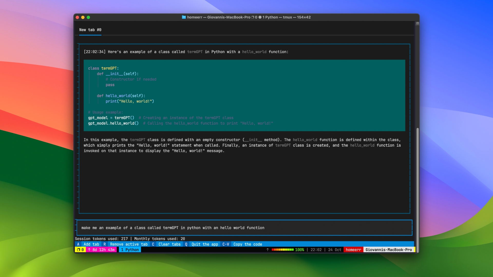

<h1 align="center">
   
  
   
  ShellGPT
   
</h1>

<h4 align="center">Your chatGPT app inside your terminal! Say goodbye to the switch process between windows.</h4>

  <a href="#key-features">Key Features</a> •

